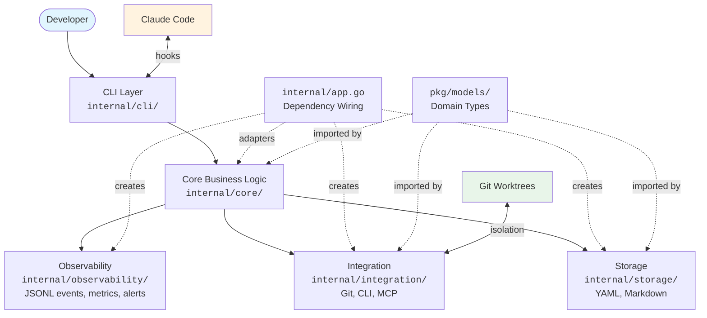
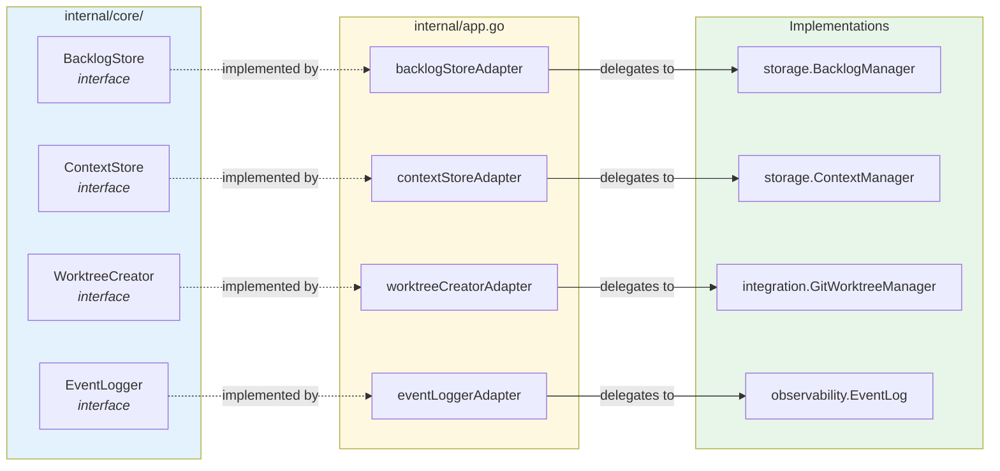
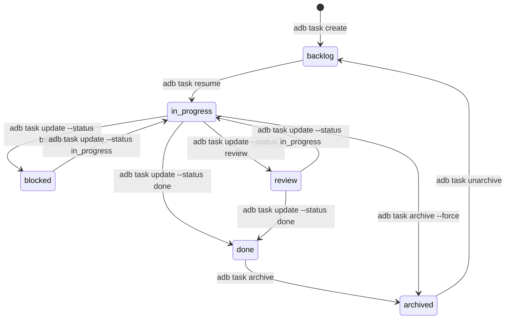
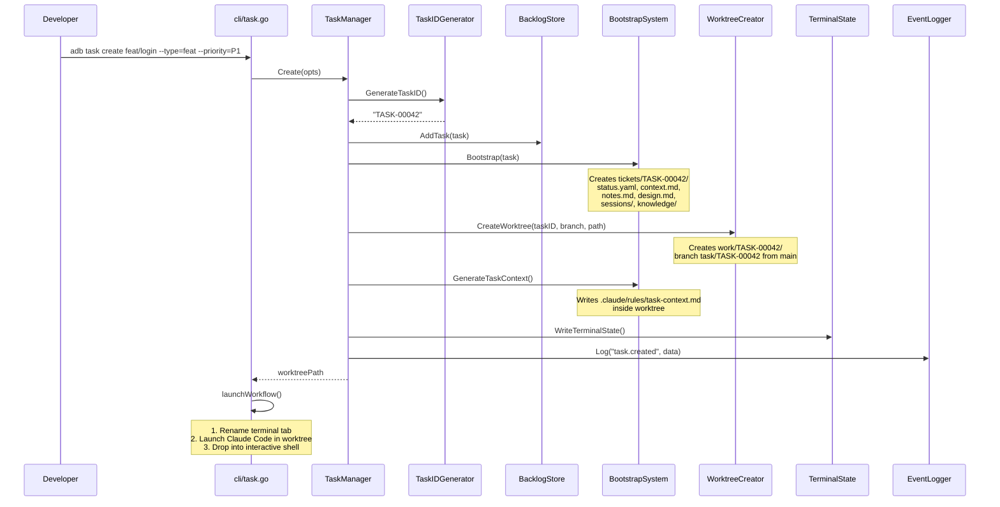
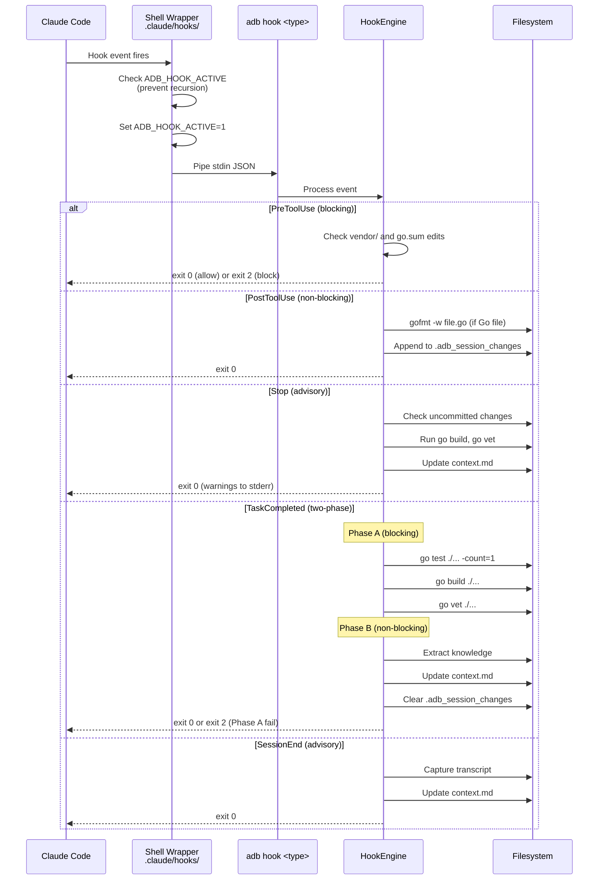
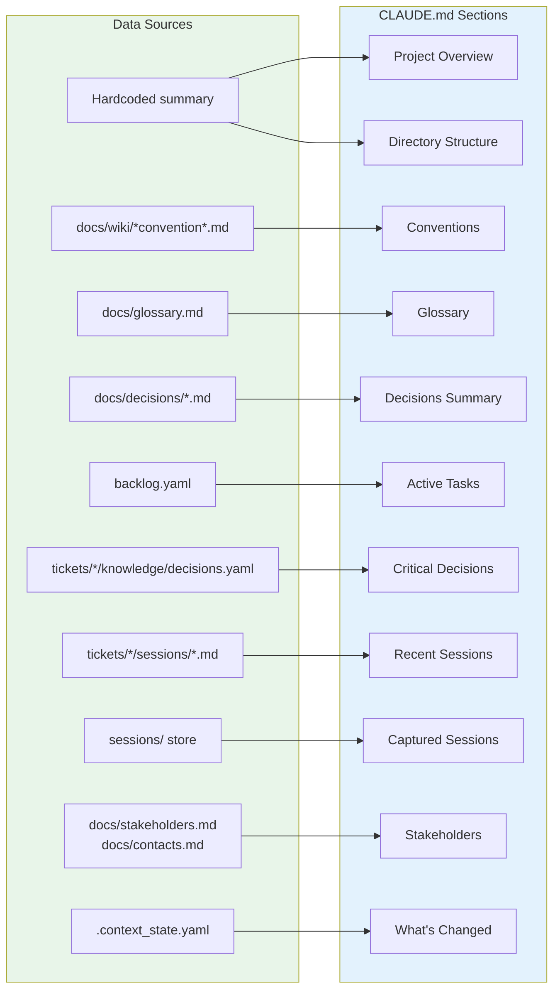
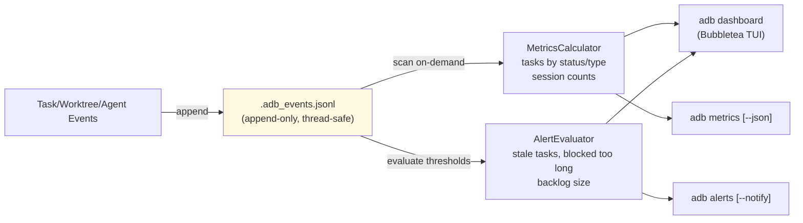
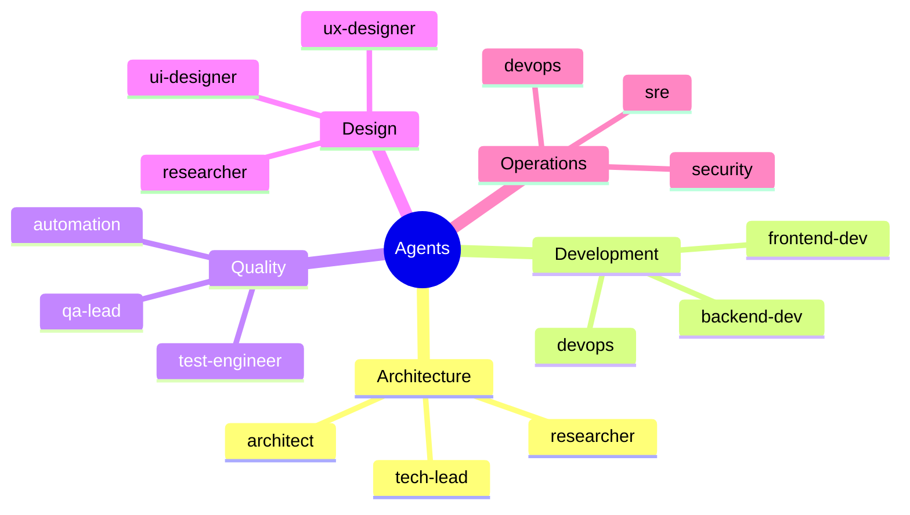
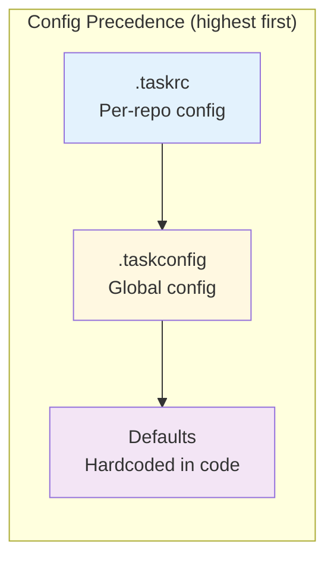
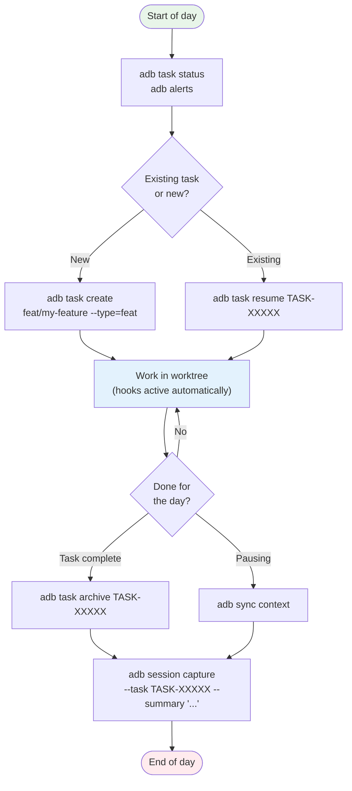

# AI Dev Brain (adb)

A Go CLI tool that wraps AI coding assistants with persistent context management, task lifecycle automation, and knowledge accumulation. It sits between the developer and their AI assistant, making AI coding sessions **stateful across sessions** by maintaining structured context, tracking changes, and auto-generating contextual information.

---

## Table of Contents

- [Architecture Overview](#architecture-overview)
- [Package Structure](#package-structure)
- [Core Design Patterns](#core-design-patterns)
- [Task Lifecycle](#task-lifecycle)
- [Hook System](#hook-system)
- [Context Generation](#context-generation)
- [Observability](#observability)
- [Multi-Agent Orchestration](#multi-agent-orchestration)
- [Configuration](#configuration)
- [State Files Reference](#state-files-reference)
- [Daily Commands](#daily-commands)
- [Build & Install](#build--install)

---

## Architecture Overview



**Layer rules:**

| Layer | Depends On | Never Imports |
|-------|-----------|---------------|
| **CLI** (`internal/cli/`) | Core only (via package-level vars) | Storage, Integration, Observability |
| **Core** (`internal/core/`) | `pkg/models/` only | Storage, Integration, Observability |
| **Storage / Integration / Observability** | `pkg/models/` | Each other, Core |
| **app.go** | Everything | -- (wiring hub) |

---

## Package Structure

```
ai-dev-brain/
  cmd/adb/main.go                  Entry point (ldflags, base path resolution)
  internal/
    app.go                         Dependency injection container + adapter structs
    cli/
      root.go                      Cobra root command
      vars.go                      Package-level variables (set by app.go)
      task.go                      adb task {create,resume,archive,status,...}
      session.go                   adb session {save,ingest,capture,list,show}
      sync.go                      adb sync {context,task-context,repos,all}
      init.go                      adb init {workspace,claude,project}
      hook.go                      adb hook {install,status,pre-tool-use,...}
      team.go                      adb team <name> <prompt>
      dashboard.go                 adb dashboard (Bubbletea TUI)
      metrics.go                   adb metrics [--json] [--since 7d]
      alerts.go                    adb alerts [--notify]
      exec.go                      adb exec <cli> [args...]
      run.go                       adb run <task-name>
      launch.go                    Workflow launcher (tab rename, Claude Code, shell)
      version.go                   adb version
    core/
      taskmanager.go               Lifecycle orchestration + local interfaces
      bootstrap.go                 Task directory scaffolding
      config.go                    Viper-based two-layer config
      templates.go                 Embedded template rendering
      taskid.go                    Sequential ID generator with flock
      aicontext.go                 CLAUDE.md generation + evolution tracking
      hookengine.go                Hook event processing (5 types, 2-phase)
      knowledge.go                 Decision/learning extraction
      conflict.go                  ADR conflict detection
      projectinit.go               Workspace scaffolding
    hooks/
      stdin.go                     Generic ParseStdin[T] for hook JSON
      tracker.go                   .adb_session_changes tracker
      artifacts.go                 Context append helpers
    storage/
      backlog.go                   backlog.yaml CRUD with file locking
      context.go                   Per-task context.md / notes.md
      communication.go             Dated stakeholder comms
      sessionstore.go              Session index + per-session dirs
    integration/
      worktree.go                  Git worktree manager (multi-repo)
      cliexec.go                   CLI executor with alias/env injection
      terminalstate.go             VS Code tab styling bridge
      tab.go                       ANSI OSC 0 tab rename
      transcript.go                JSONL transcript parser
      version.go                   Semver parsing + feature gates
      offline.go                   Connectivity detection
      mcpclient.go                 MCP server health checks
      reposync.go                  Parallel repo fetch/prune/merge
      taskfilerunner.go            Taskfile.yaml discovery + execution
      screenshot.go                OS-specific screen capture
      filechannel.go               File-based inbox/outbox
    observability/
      eventlog.go                  Append-only JSONL (.adb_events.jsonl)
      metrics.go                   On-demand metric aggregation
      alerting.go                  Threshold-based alert evaluation
  pkg/models/                      Shared domain types (Task, Config, Session, etc.)
  templates/claude/                Embedded templates (context.md, notes.md, etc.)
  Makefile                         Build targets
  Dockerfile                       Multi-stage Alpine build
  .golangci.yml                    Linter configuration
  .goreleaser.yml                  Cross-platform release config
  .github/workflows/ci.yml        CI pipeline
```

---

## Core Design Patterns

### Local Interfaces + Adapter Bridging

The single most important pattern in the codebase. Core defines its own interfaces so it never imports storage/integration/observability directly. `app.go` bridges them with adapter structs.



**All 7 bridged interfaces:**

| Core Interface | Adapter | Bridges To |
|---------------|---------|-----------|
| `BacklogStore` | `backlogStoreAdapter` | `storage.BacklogManager` |
| `ContextStore` | `contextStoreAdapter` | `storage.ContextManager` |
| `WorktreeCreator` | `worktreeCreatorAdapter` | `integration.GitWorktreeManager` |
| `WorktreeRemover` | `worktreeRemoverAdapter` | `integration.GitWorktreeManager` |
| `EventLogger` | `eventLoggerAdapter` | `observability.EventLog` |
| `SessionCapturer` | `sessionCapturerAdapter` | `storage.SessionStoreManager` |
| `TerminalStateUpdater` | `terminalStateUpdaterAdapter` | `integration.TerminalStateWriter` |

### Domain Types

```
TaskType:    feat | bug | spike | refactor
TaskStatus:  backlog | in_progress | blocked | review | done | archived
Priority:    P0 (critical) | P1 (high) | P2 (medium, default) | P3 (low)
```

---

## Task Lifecycle

### State Machine



### Create Task (End-to-End Flow)



### Task Directory Structure

When a task is created, the following is scaffolded:

```
tickets/TASK-00042/
  status.yaml            Task metadata (ID, type, status, timestamps)
  context.md             AI-maintained running context
  notes.md               Requirements and acceptance criteria
  design.md              Technical design document
  sessions/              Session summaries
  knowledge/
    decisions.yaml       Extracted decisions (initially empty)

work/TASK-00042/         Git worktree (isolated branch)
  .claude/rules/
    task-context.md      Auto-generated context for the AI
```

---

## Hook System

Hooks integrate with Claude Code to enforce quality, track changes, and extract knowledge. The architecture is hybrid: shell wrappers set the environment and pipe stdin to the Go binary.

### Hook Flow



### Hook Reference

| Hook | Blocking? | What It Does |
|------|-----------|-------------|
| **PreToolUse** | Yes (exit 2 blocks) | Blocks `vendor/` and `go.sum` edits |
| **PostToolUse** | No | Auto-formats Go files with `gofmt`; tracks changes to `.adb_session_changes` |
| **Stop** | No (advisory) | Checks uncommitted changes, build, vet; updates `context.md` |
| **TaskCompleted** | Phase A: Yes; Phase B: No | Phase A: tests + lint + build. Phase B: knowledge extraction |
| **SessionEnd** | No | Captures transcript; updates `context.md` |

### Change Tracker

PostToolUse appends to `.adb_session_changes`:

```
2025-03-13T10:30:00Z|modified|/path/to/file.go
2025-03-13T10:31:00Z|created|/path/to/new_file.go
```

Stop and SessionEnd consume this file to produce batched context summaries, then clean up.

---

## Context Generation

`adb sync context` regenerates the root-level `CLAUDE.md` by assembling 11 sections from diverse data sources.

### Section Assembly



### Context Evolution Tracking

Each sync computes SHA-256 hashes of every section and stores them in `.context_state.yaml`. On the next sync, changed sections are listed in the **"What's Changed"** section so the AI knows what's new since it last looked.

```
.context_state.yaml:
  last_generated: "2025-03-13T11:00:00Z"
  section_hashes:
    overview: "a3b9c1..."
    active_tasks: "f7e2d4..."    <-- changed since last sync
    conventions: "d1c8a2..."
```

---

## Observability

### Event Pipeline



### Event Types

| Event | Emitted By |
|-------|-----------|
| `task.created` | TaskManager.Create |
| `task.completed` | TaskManager.UpdateStatus |
| `task.status_changed` | TaskManager.UpdateStatus |
| `task.archived` | TaskManager.Archive |
| `task.unarchived` | TaskManager.Unarchive |
| `task.deleted` | TaskManager.Delete |
| `task.priority_changed` | TaskManager.UpdatePriority |
| `worktree.created` | TaskManager.Create |
| `worktree.removed` | TaskManager.Cleanup / Archive |
| `agent.session_started` | Session capture |
| `knowledge.extracted` | HookEngine (Phase B) |

### Alert Thresholds

| Condition | Default Threshold | Severity |
|-----------|-------------------|----------|
| `task_blocked_too_long` | 24 hours | High |
| `task_stale` | 3 days (no activity) | Medium |
| `review_too_long` | 5 days | Medium |
| `backlog_too_large` | 10 tasks | Low |

Thresholds are configurable via `.taskconfig` under `notifications.alerts`.

---

## Multi-Agent Orchestration

Launch a team of specialized agents against a prompt:

```bash
adb team dev "Implement user authentication with JWT"
```

### Available Agents



### Pre-configured Teams

| Team | Agents | Use Case |
|------|--------|----------|
| **dev** | backend-dev, frontend-dev, devops | Feature implementation |
| **qa** | test-engineer, qa-lead, automation | Test strategy and execution |
| **design** | ux-designer, ui-designer, researcher | UI/UX design work |
| **research** | architect, tech-lead, researcher | Architecture decisions |
| **ops** | sre, devops, security | Infrastructure and security |

---

## Configuration

### Two-Layer Config (`.taskconfig` + `.taskrc`)



### `.taskconfig` (Global)

```yaml
task_id_prefix: "TASK"
defaults:
  priority: "P2"
  type: "feat"
hooks:
  enabled: true
  pre_tool_use: true
  post_tool_use: true
  stop: true
  task_completed: true
  session_end: true
  knowledge_extraction: false      # Phase 2/3 (opt-in)
  conflict_detection: false        # Phase 2/3 (opt-in)
  auto_format: true
  block_vendor_edits: true
notifications:
  enabled: false
aliases:
  aliases: {}
```

### `.taskrc` (Per-Repo)

```yaml
name: "my-project"
ai_provider: "claude"
task_id_prefix: "TASK"
build_command: "go build ./..."
test_command: "go test ./... -count=1"
lint_command: "golangci-lint run ./..."
base_branch: "main"
worktree_base_path: "work"
reviewers: []
conventions: []
```

---

## State Files Reference

| File | Format | Scope | Purpose |
|------|--------|-------|---------|
| `.taskconfig` | YAML | Global | Project configuration (Viper) |
| `.taskrc` | YAML | Per-repo | Repository-specific config |
| `.task_counter` | Plain text | Global | Sequential task ID counter |
| `.session_counter` | Plain text | Global | Sequential session ID counter |
| `backlog.yaml` | YAML | Global | Central task registry |
| `.adb_events.jsonl` | JSONL | Global | Append-only event log |
| `.context_state.yaml` | YAML | Global | Context section hashes for change detection |
| `.adb_terminal_state.json` | JSON | Global | VS Code tab styling bridge |
| `.adb_mcp_cache.json` | JSON | Global | MCP health check cache (TTL) |
| `.adb_session_changes` | Pipe-delimited text | Per-session | Modified files tracker |
| `tickets/TASK-XXXXX/status.yaml` | YAML | Per-task | Task metadata |
| `tickets/TASK-XXXXX/context.md` | Markdown | Per-task | AI-maintained running context |
| `tickets/TASK-XXXXX/notes.md` | Markdown | Per-task | Requirements and acceptance criteria |
| `tickets/TASK-XXXXX/design.md` | Markdown | Per-task | Technical design |
| `tickets/TASK-XXXXX/knowledge/decisions.yaml` | YAML | Per-task | Extracted decisions |
| `sessions/index.yaml` | YAML | Global | Captured session registry |
| `sessions/S-XXXXX/session.yaml` | YAML | Per-session | Session metadata |

---

## Daily Commands

This section covers the commands you'll use most frequently, organized by workflow.

### Starting Your Day

```bash
# See what's on your plate
adb task status

# Check for anything that needs attention
adb alerts

# Quick health overview (TUI dashboard)
adb dashboard
```

### Working on a New Feature

```bash
# Create a task with an isolated worktree
adb task create feat/user-auth --type=feat --priority=P1

# This:
#   1. Generates TASK-00042
#   2. Scaffolds tickets/TASK-00042/ (context, notes, design, knowledge)
#   3. Creates work/TASK-00042/ (git worktree, new branch from main)
#   4. Generates .claude/rules/task-context.md in the worktree
#   5. Renames your terminal tab
#   6. Launches Claude Code inside the worktree
#   7. Drops you into an interactive shell in the worktree
```

### Resuming Yesterday's Work

```bash
# Pick up where you left off
adb task resume TASK-00042

# This:
#   1. Promotes status from backlog -> in_progress (if needed)
#   2. Launches Claude Code with --resume in the worktree
#   3. Drops you into the worktree shell
```

### During a Coding Session

The hook system works automatically while Claude Code is running:

- **Every file edit**: Go files auto-formatted, changes tracked
- **vendor/ or go.sum edits**: Blocked automatically
- **When Claude stops**: Advisory warnings (uncommitted changes, build issues)
- **When a task completes**: Tests run, knowledge extracted, context updated

You can also run commands manually in the worktree:

```bash
# Execute a command with task env vars injected
adb exec go test ./...

# Run a Taskfile.yaml task
adb run lint
```

### Updating Task State

```bash
# Task is blocked by something
adb task update TASK-00042 --status blocked

# Move to code review
adb task update TASK-00042 --status review

# Bump priority
adb task priority TASK-00042 --priority P0

# Mark done
adb task update TASK-00042 --status done
```

### Finishing a Task

```bash
# Archive: generates handoff.md, moves to _archived/, removes worktree
adb task archive TASK-00042

# Or just remove the worktree but keep ticket data
adb task cleanup TASK-00042
```

### Keeping Context Fresh

```bash
# Regenerate CLAUDE.md after codebase changes
adb sync context

# Regenerate per-worktree task context
adb sync task-context TASK-00042

# Sync everything (context + repos + claude-user)
adb sync all
```

### Working with Sessions

```bash
# Capture a session summary manually
adb session capture --task TASK-00042 --summary "Implemented JWT auth"

# List all captured sessions
adb session list

# Filter by task
adb session list --task TASK-00042

# View session details
adb session show SES-00001 --turns
```

### Multi-Agent Work

```bash
# Launch a dev team against a prompt
adb team dev "Implement REST API for user management"

# Launch a QA team
adb team qa "Create integration test suite for the auth module"

# Launch architecture review
adb team research "Evaluate event sourcing vs CQRS for order management"

# List available agents
adb agents
```

### Monitoring and Metrics

```bash
# View metrics for the last 7 days
adb metrics --since 7d

# JSON output for scripting
adb metrics --json

# Check active alerts
adb alerts

# Full TUI dashboard
adb dashboard
```

### Setting Up a New Project

```bash
# Full project scaffolding with BMAD artifacts
adb init project ./my-new-project --name "My Project" --git --bmad

# Initialize just the workspace structure
adb init workspace .

# Add Claude Code configuration
adb init claude . --managed

# Install hook wrappers
adb hook install

# Verify hooks are installed
adb hook status
```

### Quick Reference Card

| What you want to do | Command |
|---------------------|---------|
| See all tasks | `adb task status` |
| Start new work | `adb task create feat/name --type=feat` |
| Resume a task | `adb task resume TASK-XXXXX` |
| Finish a task | `adb task archive TASK-XXXXX` |
| Refresh AI context | `adb sync context` |
| Check project health | `adb dashboard` |
| Launch agent team | `adb team dev "prompt"` |
| View recent sessions | `adb session list` |
| Check for problems | `adb alerts` |
| Run with env injection | `adb exec <command>` |

### Typical Daily Workflow



---

## Build & Install

### From Source

```bash
# Build
make build

# Run tests (with race detector)
make test

# Lint
make lint

# All checks + build
make all

# Install to ~/.local/bin/
make install-local
```

### Makefile Targets

| Target | Description |
|--------|-----------|
| `make build` | Build binary with version/commit/date ldflags |
| `make test` | `go test ./... -race -count=1` |
| `make lint` | `golangci-lint run ./...` |
| `make vet` | `go vet ./...` |
| `make fmt` | `gofmt -s -w .` |
| `make security` | `govulncheck ./...` |
| `make docker-build` | Multi-stage Alpine Docker build |
| `make install-local` | Install to `~/.local/bin/adb` |
| `make clean` | Remove build artifacts |
| `make all` | fmt + vet + lint + test + build |

### Docker

```bash
make docker-build
docker run --rm adb version
```

The Dockerfile uses a two-stage Alpine build: `golang:1.22-alpine` builder with `CGO_ENABLED=0`, runtime on `alpine:3.21` with `git` and `ca-certificates`.

### Release

GoReleaser builds for 6 platform/arch combinations:

| OS | Architectures |
|----|--------------|
| Linux | amd64, arm64 |
| macOS | amd64, arm64 |
| Windows | amd64, arm64 |

```bash
# Tag and release
git tag v1.0.0
git push --tags
# GoReleaser runs on tag push via CI
```
