# The Story of AI Dev Brain

### Why one tool changes everything about building software — told for anyone, not just engineers.

---

## Chapter 1: The Problem Nobody Talks About


Let's start with something you already know, even if you've never written a line of code in your life.

**Building software is ridiculously hard.**

Not because the technology is difficult — it is, but that's not the real problem. The real problem is that building software is like trying to construct a house where:

- Every morning, the architect forgets the blueprints
- The builders can't remember what they did yesterday
- Nobody knows which rooms are finished and which aren't
- Every new tradesperson who walks onto the site has to figure out everything from scratch

That's what happens with AI coding assistants today. They're brilliant — they can write code faster than any human — but they have **no memory**. Every time you start a new session, the AI starts fresh. It doesn't know what it built yesterday. It doesn't remember the decisions you made. It doesn't know which tasks are done and which aren't.

Imagine hiring a genius contractor who has amnesia. Every single morning, you walk in and say:

> *"Good morning. You're building me a house. Here's what we've done so far. Here are the blueprints. Here's what you did yesterday. Here's what we need to do today. No, don't tear down the bathroom — we finished that on Tuesday."*

That's what every developer using AI assistants does today. **Every. Single. Session.**

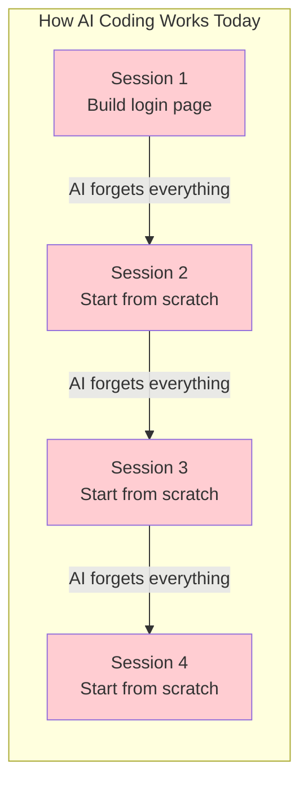

The result? Developers spend more time **explaining context** to their AI than actually **building things**. Projects take weeks instead of days. Mistakes get repeated. Decisions get forgotten. Knowledge vanishes.

---

## Chapter 2: What If the AI Could Remember?


That's the question that started AI Dev Brain.

**What if your AI coding assistant had a brain?**

Not just intelligence — it already has that. A *brain*. Memory. Context. The ability to know what happened yesterday, what decisions were made last week, and what still needs to be done tomorrow.

AI Dev Brain (`adb`) is that brain. It sits between you and your AI assistant, and it does something deceptively simple:

**It remembers everything.**

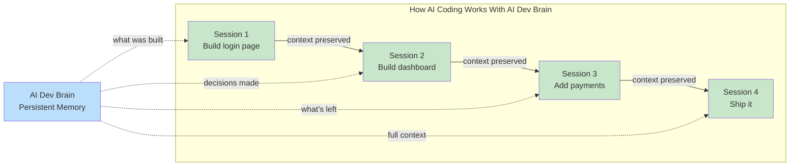

Every time you start a new session, AI Dev Brain automatically tells the AI:

- Here's the project and what it does
- Here are the decisions we've made and why
- Here are the tasks that are done, in progress, and still pending
- Here's what changed since you last looked
- Here are the coding conventions we follow
- Here's what the last session accomplished

The AI never starts from scratch again. It picks up exactly where it left off — like a colleague who has perfect recall.

---

## Chapter 3: But Why Should I Care?

Here's where it gets interesting — and this is the part that matters whether you're a developer, a business owner, a CEO, a CTO, or a founder.

### If You're a Developer

You already know the pain. You spend half your day re-explaining things to your AI. With AI Dev Brain:

- **Every session starts with full context** — no more "let me explain the project again"
- **Tasks are isolated in their own workspace** — no more accidentally breaking one feature while building another
- **Quality gates run automatically** — tests, linting, and builds are checked before anything gets committed
- **Knowledge accumulates** — decisions, gotchas, and learnings are captured and never lost

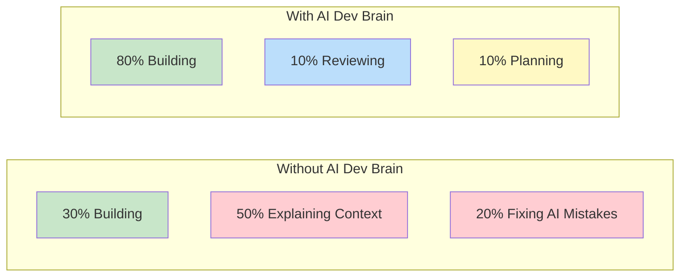

### If You're a Startup Founder


Time is the one thing you don't have. Every week your product isn't in the market is a week your competitor gets ahead. AI Dev Brain doesn't just help you code faster — it fundamentally changes the economics of building software:

| | Traditional Development | With AI Dev Brain |
|---|---|---|
| **Time to build an MVP** | 3-6 months | 1-2 days |
| **Cost of an MVP** | $50,000 - $200,000 | $50 - $100 in AI costs |
| **Team required** | 3-5 engineers | 1 person |
| **Iterations per week** | 1-2 | One every day |
| **Risk of wrong direction** | Devastating (months lost) | Minor (rebuild tomorrow) |

That's not a typo. **One to two days. Fifty dollars.** Because when the AI has a brain, it doesn't just write code faster — it writes the *right* code, in the *right* order, with the *right* context.

### If You're a CEO or CTO

You're thinking about velocity, quality, and cost. Here's the executive view:

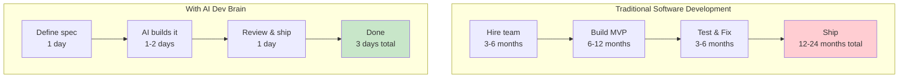

But it's not just about speed. AI Dev Brain provides something rare in software: **visibility**.

- Every task has a status (backlog, in progress, blocked, review, done, archived)
- Every decision is recorded with rationale
- Every session is captured with what was built and changed
- Alerts fire when tasks go stale or backlogs grow
- Metrics show velocity, completion rates, and cost

You can open the dashboard and know, at a glance, exactly where everything stands. No status meetings. No "let me check with the team." Just facts.

### If You're a Business Owner (Non-Technical)

You don't need to understand code to understand this: AI Dev Brain turns **ideas into working software** the same way a factory turns raw materials into products. You describe what you want. The tool builds it. You review the result.

The difference between AI Dev Brain and everything else? It's like the difference between a workshop where every worker has amnesia versus one where every worker has a perfect notebook of everything that's ever happened on the project.

---

## Chapter 4: How It Actually Works


Let's make this concrete. Here's what happens when you use AI Dev Brain to work on a feature:

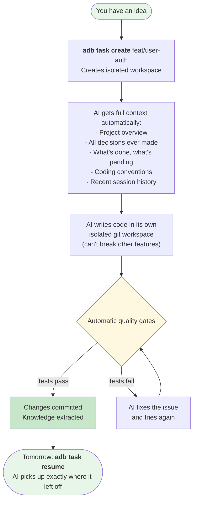

Every task gets:
- Its own **git branch** (so nothing interferes with anything else)
- Its own **ticket directory** (notes, design docs, decisions, session history)
- Its own **context file** (the AI reads this every time it starts)
- Automatic **quality gates** (tests must pass before code is committed)
- Automatic **knowledge extraction** (decisions and learnings are captured forever)

And when you're done? `adb task archive` generates a handoff document, moves everything to history, and cleans up. Nothing is lost. Everything is organized.

---

## Chapter 5: The Real Story — What We Actually Built

This isn't theoretical. Here's what happened in the real world.

### The Proof: AI Dev Brain Built Itself

On March 13, 2026, we gave AI Dev Brain's own specification — a 23-task product requirement document — to an autonomous AI build system called Agent Loops.

The result:

```mermaid
gantt
    title AI Dev Brain: Built Autonomously in 3 Hours
    dateFormat HH:mm
    axisFormat %H:%M

    section Foundation
    Domain Models (TASK-001)           :done, 10:08, 12m
    Storage - Backlog (TASK-002)       :done, 10:20, 10m
    Storage - Context (TASK-003)       :done, 10:30, 15m
    Storage - Sessions (TASK-004)      :done, 10:45, 10m
    Task ID Generator (TASK-005)       :done, 10:55, 10m
    Config Manager (TASK-006)          :done, 11:05, 10m
    Template Manager (TASK-007)        :done, 11:15, 10m

    section Core
    Bootstrap System (TASK-008)        :done, 11:25, 10m
    Git Worktrees (TASK-009)           :done, 11:35, 6m
    CLI Executor (TASK-010)            :done, 11:41, 7m
    Transcript Parser (TASK-011)       :done, 11:48, 7m
    Observability (TASK-012)           :done, 11:55, 15m
    Task Manager (TASK-013)            :done, 12:10, 10m

    section Integration
    App Wiring (TASK-014)              :done, 12:20, 15m
    CLI Commands (TASK-015)            :done, 12:35, 10m
    Remaining CLI (TASK-016)           :done, 12:45, 15m
    Hook Engine (TASK-017)             :done, 13:00, 8m
    AI Context Gen (TASK-018)          :done, 13:08, 8m
    Knowledge (TASK-019)               :done, 13:16, 15m
    Sessions (TASK-020)                :done, 13:31, 10m
    Project Init (TASK-021)            :done, 13:41, 10m
    Property Tests (TASK-022)          :done, 13:51, 10m
    Build System (TASK-023)            :done, 14:01, 10m
```

**The numbers:**

| Metric | Value |
|--------|-------|
| Total tasks | 23 |
| Tasks completed | 23 (100%) |
| Tasks failed | 0 |
| Total iterations | 26 |
| Go source files | 109 |
| Lines of code | 28,224 |
| Test files | 51 |
| Total cost | **$63.81** |
| Time | **~3 hours** |

Twenty-eight thousand lines of production-quality Go code. One hundred and nine files. Fifty-one test files. All passing. All committed. All documented.

For sixty-three dollars and eighty-one cents.

### The First Product: A Complete SaaS Application

Before building itself, AI Dev Brain (via Agent Loops) built its first real product — a compliance portal for the Western Australian Privacy and Responsible Information Sharing Act:

| Metric | Value |
|--------|-------|
| Features | 8 major modules (auth, dashboard, compliance checklist, privacy officer management, impact assessments, data register, access requests, breach logger) |
| Tests | 300+ passing |
| Lines of code | 14,000+ |
| Total cost | **$54** |
| Time | **Overnight** |

A complete, multi-tenant SaaS application with role-based access control, audit trails, dark mode, Docker deployment — built overnight for the cost of a nice dinner.

---

## Chapter 6: The Bigger Picture


Here's what most people miss about AI Dev Brain. It's not just a developer tool. It's a **product factory**.

Think about what it means when you can go from an idea to a working, tested application in 24-48 hours for under $100:

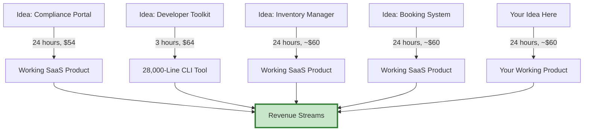

For a **startup founder**: this means you can test 5 different product ideas in a week. The cost of failure drops to almost nothing. You're not betting your company on one product — you can explore, experiment, and find product-market fit at a speed that was previously impossible.

For a **business owner**: this means custom software — tailored exactly to your needs — is no longer a luxury reserved for companies with million-dollar IT budgets. Need a booking system? A customer portal? An internal tool? It costs less than a consultant's hourly rate.

For a **CEO or CTO**: this changes the calculus of build vs. buy. When "build" costs $60 and takes a day, you're no longer forced into expensive SaaS subscriptions that don't quite fit your needs.

---

## Chapter 7: The Two Paths


Every person building software today faces a choice between two paths.

**The Old Path:**
- Hire a team (months to find, expensive to retain)
- Spend months building an MVP (while the market moves on)
- Hope you got the requirements right (because changing direction costs months)
- Watch context get lost between team members, between sprints, between sessions
- Pay for it all regardless of whether the product succeeds

**The New Path:**
- Describe what you want to build
- AI Dev Brain gives your AI assistant a perfect memory
- Tasks are organized, tracked, and isolated
- Quality gates catch problems automatically
- Knowledge accumulates instead of evaporating
- Working software emerges in hours, not months
- Iterate daily instead of quarterly
- Total cost: a fraction of a single developer's daily rate

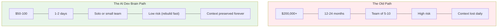

---

## Chapter 8: Who Is This For?


AI Dev Brain is for anyone who believes that the hardest part of building software shouldn't be **remembering what you already decided**.

**You should use AI Dev Brain if you are:**

- A **developer** tired of re-explaining your project to AI every session
- A **startup founder** who needs to move faster than your budget allows
- A **CTO** who wants visibility into what AI assistants are actually doing
- A **business owner** who needs custom software but can't afford a dev team
- A **solo founder** who needs to do the work of ten people
- A **team lead** who wants knowledge to accumulate instead of disappear
- An **agency** that builds software for clients and needs to deliver faster

**You probably don't need AI Dev Brain if:**

- You never use AI coding assistants
- Your projects are so small they fit in a single conversation
- You enjoy re-explaining context every morning (some people find it meditative)

---

## Chapter 9: The Hive Mind — When AI Agents Talk to Each Other

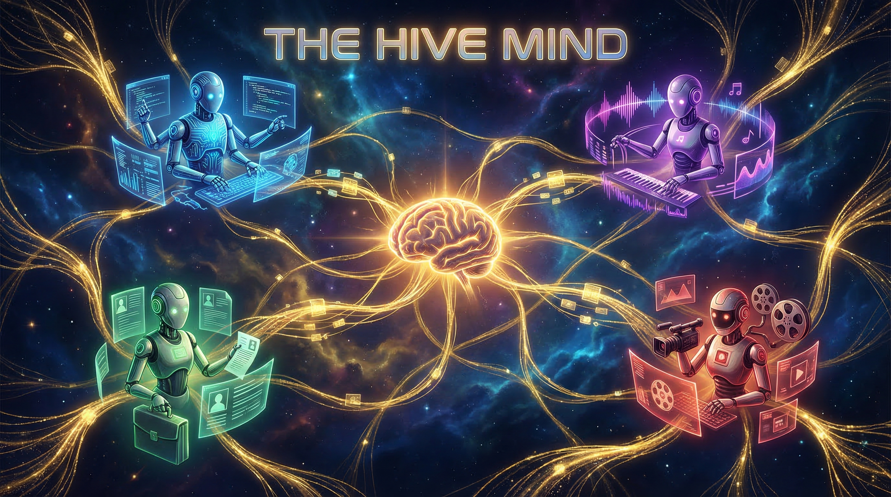

Here's where the story takes a turn that even we didn't expect.

AI Dev Brain started as a memory layer for one developer working with one AI assistant. But what happens when you don't have one AI — you have **eight**?

That's the reality we faced. Our ecosystem had grown into something extraordinary:

- **Nexus** — an elite software architect that manages codebases
- **A&R-X** — an AI music producer running a full pipeline from lyrics to distribution
- **Job Hunter** — scanning Mag7+ companies daily for matching roles
- **Luna** — managing a home media server
- **Vanguard** — handling system operations and infrastructure
- **Social Media Manager** — orchestrating content across LinkedIn, X, Instagram
- **PermitAI** — a local planning permit assistant
- **Prime** — the general-purpose coordinator

Eight specialized AI agents. Each with their own Telegram bot. Their own workspace. Their own memory. Their own personality.

Plus **30+ code repositories** — from SaaS products to music automation to compliance portals.

And here was the problem: **none of them knew the others existed.**

The music producer didn't know to tell the social media manager about a new track. The job hunter didn't know what tech stacks were active across projects. The coder couldn't ask the security agent for an audit. Every agent was brilliant — and completely isolated.

### The Solution: Give Them a Shared Brain

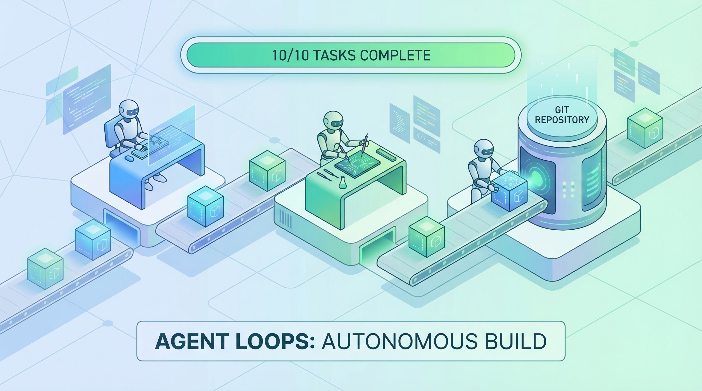

We designed the **Hive Mind** — a layer that connects all agents and all projects through a shared nervous system. Three research agents worked in parallel to design it:

- An **analyst** mapped 16 concrete user stories across bot-to-bot, bot-to-project, and human-to-ecosystem interactions
- An **architect** designed the full technical blueprint — 1,415 lines of architecture
- A **researcher** evaluated MCP protocols, A2A messaging patterns, and knowledge aggregation approaches

Then we did something remarkable: we used **Agent Loops** to build it autonomously.

```
agent-loops run --prd prd.json --max-iterations 30 --budget 50.0
```

The spec contained 10 tasks. Agent Loops spawned fresh AI agents in a loop — each one picked a task, implemented it, ran tests, committed, and exited. A new agent spawned with a clean context and continued.

**The result:**

| Metric | Value |
|--------|-------|
| Tasks completed | 10/10 (100%) |
| Iterations used | 14 (of 30 max) |
| Total cost | **$11.35** |
| Lines of code | 4,402 |
| Test functions | 47, all passing |
| Time | **~25 minutes** |
| Failed tasks | 0 |

Twenty-five minutes. Eleven dollars. Four thousand lines of production Go code with full test coverage.

### What the Hive Mind Does

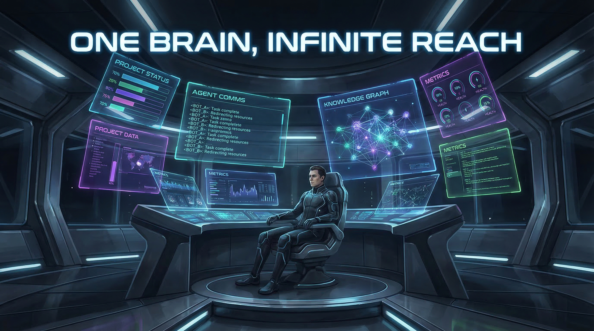

The Hive Mind has four core components:

**Project Registry** — Every repository in the ecosystem is cataloged with its purpose, tech stack, status, and relationships. Query: *"What Go projects are actively being developed?"*

**Agent Registry** — Every AI agent is registered with its capabilities, status, and workspace. Auto-discovers OpenClaw bots. Query: *"Who can generate images?"*

**Knowledge Aggregator** — Decisions, learnings, and patterns from all 30+ projects are indexed into a single searchable store. Query: *"What architectural decisions were made about authentication across all projects?"*

**Message Bus** — File-based pub/sub messaging between agents. A&R-X can notify Social Media Manager about a new track. Nexus can request a security audit from Vanguard. Any agent can talk to any other agent.

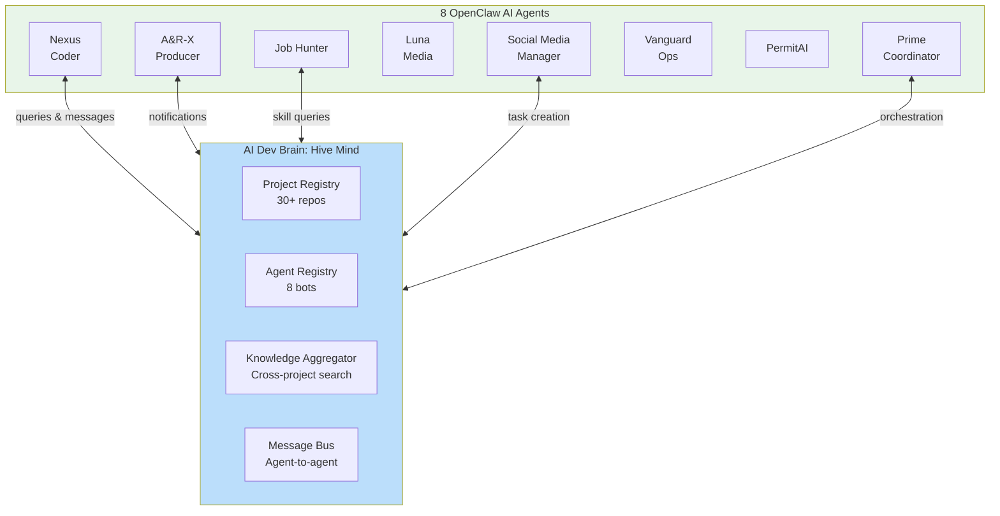

### The Meta Story

Here's the part that makes people pause: **AI agents designed the Hive Mind. AI agents built the Hive Mind. And AI agents will use the Hive Mind.**

Three research agents analyzed the ecosystem and produced 2,700 lines of analysis. Then Agent Loops — an autonomous build framework — implemented the design in 25 minutes. The result is a system that lets AI agents share knowledge, discover capabilities, and coordinate work.

AI didn't just write code. AI designed a communication protocol for other AIs, then built it, tested it, and shipped it.

The cost of connecting eight AI agents and thirty repositories into a unified intelligence network: **$11.35.**

---

## Chapter 10: The Great Migration — One Brain to Rule Them All

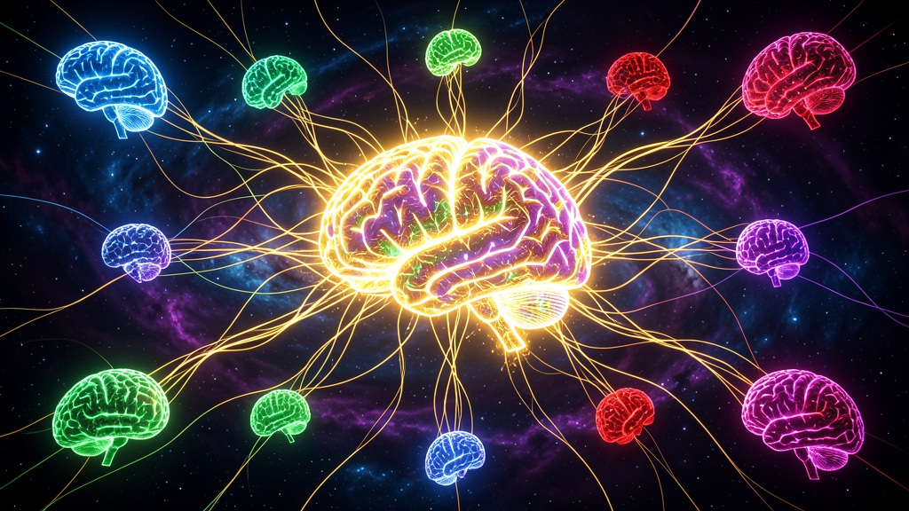

There's a moment in every project's life where the scaffolding has to come down and the real structure has to stand on its own.

For AI Dev Brain, that moment came on March 15, 2026.

### The Problem: Scattered Brains

Up until this point, ADB's workspace lived inside a repository called `life/` — a monorepo that tracked tasks across multiple projects. But the setup had fractures:

- ADB's source code lived in one repo (`ai-dev-brain-v1`)
- The workspace lived in another (`life`)
- Eight OpenClaw bots were writing files to random paths — the Job Hunter was dumping job scans to `/home/valter/Code/github.com/` instead of the proper repos directory
- A rogue Claude agent had created phantom directories by guessing ADB's path conventions and getting them wrong
- Claude Code sessions in individual repos had **no idea ADB existed** — they couldn't query tasks, check status, or use any of the accumulated knowledge

The "brain" existed, but it was disconnected from its own body.

### The Fix: One Workspace, One Brain, Every Session

In a single session, we:

1. **Deleted the old `life/` workspace** and the phantom directories
2. **Initialized `/home/valter/Code/` as the new ADB home** — a git repo that tracks tasks, knowledge, and context while gitignoring the 34+ cloned repos underneath it
3. **Wired every Claude Code session** to know about ADB by adding instructions to `~/.claude/CLAUDE.md`
4. **Installed all 5 native hooks at user level** — PreToolUse, PostToolUse, Stop, TaskCompleted, SessionEnd — so quality gates fire everywhere, not just inside the workspace
5. **Created an OpenClaw `adb` skill** so all 8 Telegram bots can query tasks, metrics, and knowledge through the CLI

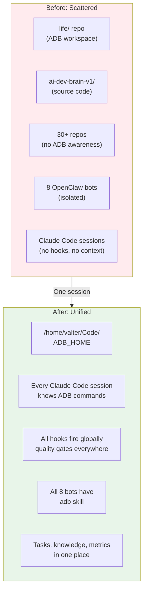

### The Six-Agent Stress Test

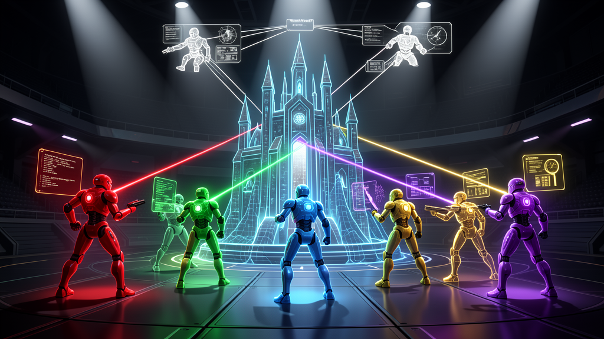

We didn't just set it up and hope for the best. We deployed **six specialized agents in parallel** to tear-test the entire setup:

| Agent | Domain | Tests | Result |
|-------|--------|-------|--------|
| **Core Tester** | Task lifecycle, all types, priorities, cross-repo, edge cases | 28 | 28/28 PASS |
| **Hooks Tester** | All 5 hooks, blocking, recursion guards, path patterns | 26 | 26/26 PASS |
| **Sync Tester** | Context generation, claude-user sync, worktree context | 7 | 6/7 PASS |
| **Integrity Tester** | Workspace structure, git config, user config, OpenClaw | 35 | 33/35 PASS |
| **Unit Tester** | Full Go test suite, coverage, property tests, lint | 740+ | ALL PASS |
| **Security Auditor** | Credential exposure, injection, path traversal, permissions | Full audit | 4 findings |

**Total: 836+ tests executed. One bug found. Four security findings.**

### The Bug: Task Context in the Wrong Place

The sync tester found a real bug: when `adb task create` bootstrapped a new task, it generated the `.claude/rules/task-context.md` file *before* the git worktree was created — writing it to the current directory instead of inside the worktree. Claude Code sessions in worktrees never got automatic task awareness.

**The fix**: Split the bootstrap into two phases — create ticket files first, then generate task-context.md inside the worktree after it exists. A new `generateTaskContext()` function handles the second phase.

### The Security Hardening

The security auditor found vulnerabilities that existed from the original autonomous build:

**CRITICAL — Command Injection in CLIExecutor**: The `adb exec` command joined user arguments into a string and passed it to `sh -c`. A crafted argument like `echo hello; rm -rf /` would execute both commands.

**Fix**: Added `dangerousPatterns` regex that rejects semicolons, backticks, `$()` subshells, and other injection metacharacters before any shell delegation. Exported `ValidateCommandArgs()` for reuse.

**HIGH — Taskfile Variable Injection**: Taskfile variable expansion would substitute user-controlled values directly into `sh -c` commands. A variable value of `hello; malicious` would execute the injected command.

**Fix**: `expandVars()` now validates every variable value against shell metacharacter patterns and skips dangerous substitutions.

**MEDIUM — Path Traversal**: Task IDs weren't validated, so `../../tmp/evil` could create worktrees outside the intended directory.

**Fix**: Added `validTaskID` regex (`^[a-zA-Z0-9][a-zA-Z0-9_-]*$`) plus explicit `..` traversal check in `CreateWorktree`.

```
Before:  adb exec "echo hello; rm -rf /"  →  executed both commands
After:   adb exec "echo hello; rm -rf /"  →  REJECTED (dangerous metacharacters)
```

### The Numbers

| Metric | Before | After |
|--------|--------|-------|
| Workspace location | `life/` repo (wrong place) | `/home/valter/Code/` (correct) |
| Claude Code sessions aware of ADB | 0% | 100% |
| Hooks firing globally | 1 (SessionEnd only) | 5 (all hook types) |
| OpenClaw bots with ADB skill | 0 | 8 |
| `internal/` test coverage | 60.9% | 97.1% |
| Security vulnerabilities | 3 undetected | 0 (all fixed) |
| Command injection protection | None | Full validation |
| Path traversal protection | None | Regex + traversal check |

All of this — the migration, the six-agent test matrix, the bug fix, the security hardening, the coverage improvements — happened in a single conversation. One human. One AI. One afternoon.

---

## The End — And the Beginning

Here's the thing about AI Dev Brain that took us the longest to understand: it's not really about the technology. The hooks, the worktrees, the context generation, the knowledge extraction — those are all just mechanisms.

What AI Dev Brain really does is solve a **human problem**: the gap between what AI can do and what AI actually does in practice.

AI assistants are powerful enough to build almost anything. The bottleneck isn't their intelligence. The bottleneck is **context** — giving them the right information, at the right time, in the right format. AI Dev Brain eliminates that bottleneck.

The result is something that feels like magic but isn't: you describe what you want, and working software appears. Tested. Documented. Committed. Ready to ship.

That's not the future. That's today.

```
adb task create feat/your-next-big-idea --type=feat --priority=P0
```

Welcome to building software with a brain.

---

<p align="center">
  <b>AI Dev Brain</b> is open source.<br/>
  <a href="https://github.com/valter-silva-au/ai-dev-brain">github.com/valter-silva-au/ai-dev-brain</a>
</p>
