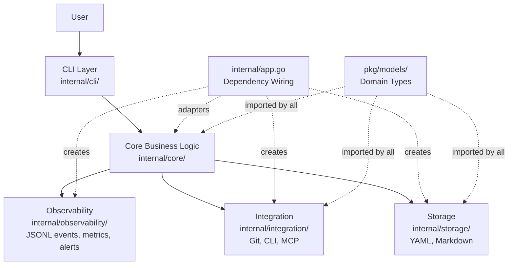
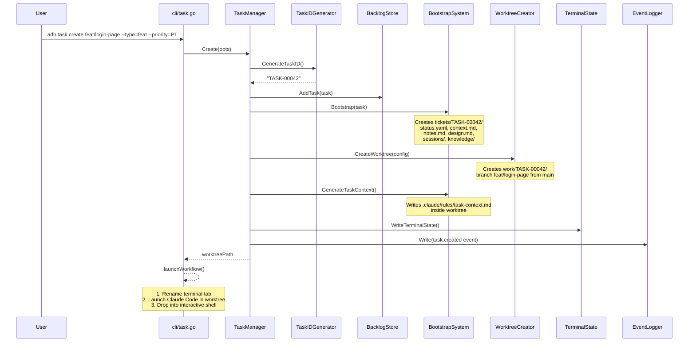
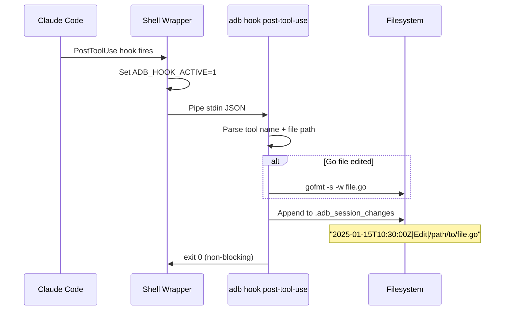
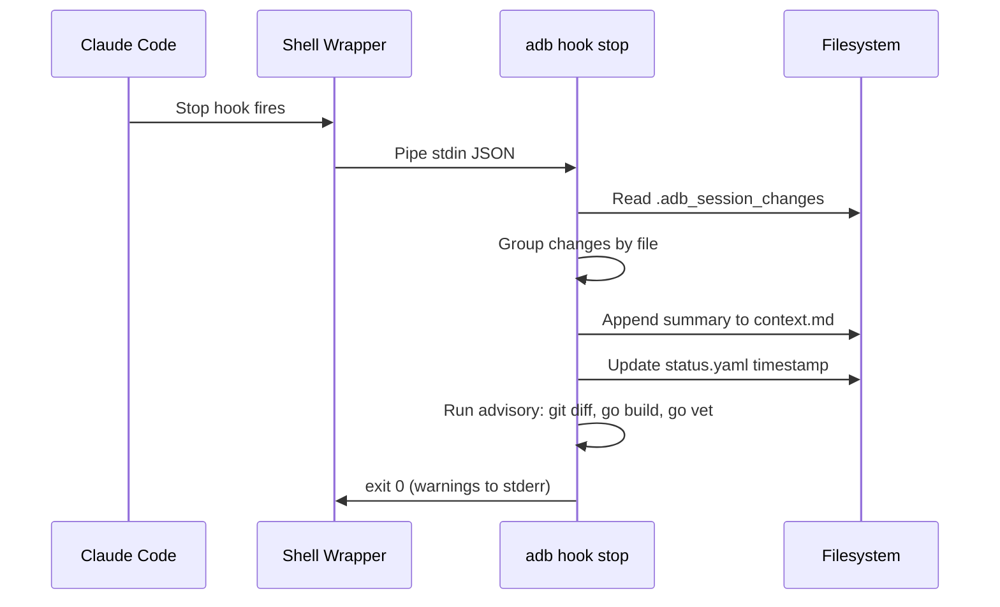

Here is the extracted text from the document across the images:

```markdown
# AI Dev Brain (adb) - Complete Project Deep Dive

This document explains everything about the AI Dev Brain project in a way optimized for another Claude Code instance to quickly understand and work with the codebase.

---

## What Is This Project?

AI Dev Brain (`adb`) is a **Go CLI tool that wraps AI coding assistants** (primarily Claude Code) with persistent context management, task lifecycle automation, and knowledge accumulation. Think of it as a "brain" layer that sits between the developer and their AI assistant, providing:

1. **Task lifecycle management** - Create, resume, archive tasks with git worktree isolation
2. **Persistent context** - Auto-generated CLAUDE.md files, per-task context.md, session capture
3. **Quality gates** - Claude Code hooks that enforce tests, linting, and code quality
4. **Knowledge accumulation** - Extract decisions, learnings, and patterns from completed tasks
5. **Observability** - Event logging, metrics, alerting for task health
6. **Multi-agent orchestration** - Launch teams of specialized Claude Code agents

The key insight: `adb` makes AI coding assistants **stateful across sessions** by maintaining structured context files, tracking changes, and auto-generating contextual information that the AI can consume on each new session.

---

## Architecture Overview



### Layer Rules

* **CLI** (`internal/cli/`) depends on **Core** only (via package-level variables)
* **Core** (`internal/core/`) depends on **nothing** except `pkg/models/` -- it defines local interfaces for everything it needs
* **Storage** (`internal/storage/`), **Integration** (`internal/integration/`), **Observability** (`internal/observability/`) implement the interfaces Core defines
* **app.go** wires everything together using adapter structs that bridge Core interfaces to implementations
* **pkg/models/** is the shared domain types package -- everyone can import it

This prevents circular imports. Core never imports storage, integration, or observability directly.

---

## The Critical Design Pattern: Local Interfaces + Adapters

This is the single most important pattern in the codebase. Understanding it unlocks everything else.

**Problem**: Core business logic needs to call storage/integration/observability, but importing those packages would create circular dependencies.

**Solution**: Core defines its own local interfaces. `app.go` creates adapter structs that implement these local interfaces by delegating to the real implementations.

```go
internal/core/taskmanager.go:
    type BacklogStore interface {    // <-- local interface in core
        Load() (*models.Backlog, error)
        Save(backlog *models.Backlog) error
        AddTask(task models.Task) error
        // ...
    }

internal/storage/backlog.go:
    type backlogManager struct { ... }   // <-- real implementation
    func (b *backlogManager) Load() ...
    func (b *backlogManager) Save() ...

internal/app.go:
    type backlogStoreAdapter struct {    // <-- bridges the two
        mgr storage.BacklogManager
    }
    func (a *backlogStoreAdapter) Load() (*models.Backlog, error) {
        return a.mgr.Load()
    }
    // ... delegates all methods

```

**Key local interfaces in Core**:

| Interface | Bridges To | Purpose |
| --- | --- | --- |
| `BacklogStore` | `storage.BacklogManager` | Task registry CRUD (backlog.yaml) |
| `ContextStore` | `storage.ContextManager` | Per-task context.md, notes.md |
| `WorktreeCreator` | `integration.GitWorktreeManager` | Create git worktrees |
| `WorktreeRemover` | `integration.GitWorktreeManager` | Remove git worktrees |
| `EventLogger` | `observability.EventLog` | Write structured events |
| `SessionCapturer` | `storage.SessionStoreManager` | Capture Claude Code sessions |
| `TerminalStateUpdater` | `integration.TerminalStateWriter` | VS Code tab styling |

**When adding new cross-package dependencies**: Define a local interface in core, implement the adapter in app.go.

---

## Package-by-Package Guide

### `cmd/adb/main.go` - Entry Point

Minimal entry point. Parses build-time ldflags (version, commit, date), resolves base path, creates the `App` struct, and executes the CLI. That's it.

**Base path resolution**: Checks `ADB_HOME` env var first, then walks up the directory tree looking for `.taskconfig`, falls back to cwd.

### `internal/app.go` - Dependency Wiring

The **single source of truth** for all dependency injection. The `App` struct has 69+ fields organized by category:

1. **Configuration**: `ConfigMgr` (Viper-based)
2. **Storage**: `BacklogMgr`, `ContextMgr`, `CommMgr`, `KnowledgeStore`, `SessionStore`
3. **Core Services**: `TaskMgr`, `Bootstrap`, `IDGen`, `TemplateMgr`, `UpdateGen`, `AICtxGen`, `DesignDocGen`, `KnowledgeExtractor`, `ConflictDetector`, `HookEngine`, `ProjectInit`
4. **Integration**: `WorktreeMgr`, `CLIExec`, `TaskfileRunner`, `TabMgr`, `TerminalState`, `TranscriptParser`, `ScreenshotPipeline`, `OfflineMgr`, `VersionChecker`, `MCPClient`, `RepoSync`
5. **Observability**: `EventLog`, `MetricsCalc`, `AlertEngine`

`NewApp(basePath)` constructs everything in dependency order and then sets the CLI package-level variables.

### `internal/cli/` - Cobra Commands

All commands are registered as Cobra commands. Dependencies arrive through **package-level variables** set by `app.go`:

```go
// internal/cli/vars.go
var (
    TaskMgr         core.TaskManager
    UpdateGen       core.UpdateGenerator
    AICtxGen        core.AIContextGenerator
    Executor        integration.CLIExecutor
    Runner          integration.TaskfileRunner
    EventLog        core.EventLogger
    AlertEngine     observability.AlertEngine
    MetricsCalc     observability.MetricsCalculator
    SessionCapture  core.SessionCapturer
    HookEngine      core.HookEngine
    BasePath        string
    // ...
)

```

**Command hierarchy** (noun-verb pattern):

```
adb
  task create <branch> --type=feat|bug|spike|refactor [--repo] [--priority] [--owner] [--tags]
  task resume <task-id>
  task archive <task-id> [--force] [--keep-worktree]
  task unarchive <task-id>
  task cleanup <task-id>
  task status [--filter <status>]
  task priority <task-id>...
  task update <task-id>
  sync context
  sync task-context [--hook-mode]
  sync repos
  sync claude-user [--dry-run] [--mcp]
  sync all
  init [path] [--name] [--ai] [--prefix]
  init claude [path] [--managed]
  exec <cli> [args...]
  run <task-name>
  metrics [--json] [--since 7d]
  alerts [--notify]
  dashboard
  session save|ingest|capture|list|show
  team <team-name> <prompt>
  agents
  mcp check [--no-cache]
  hook {install,status,pre-tool-use,post-tool-use,stop,task-completed,session-end}
  version

```

Old top-level commands (`adb feat`, `adb resume`, etc.) still work but print deprecation warnings.

**The `launchWorkflow` function** (in `feat.go`) is the main automation entry point:

1. Renames terminal tab with task ID
2. Updates terminal state for VS Code styling
3. Launches Claude Code in the worktree (with `--resume` for resumed tasks)
4. Drops user into interactive shell in the worktree

### `internal/core/` - Business Logic

This is the heart of the system. ~22 implementation files, ~4,200 lines.

#### TaskManager (`taskmanager.go`)

Orchestrates the full task lifecycle:

* **Create**: Generates sequential task ID (TASK-XXXXX), adds to backlog.yaml, calls BootstrapSystem to scaffold directories and create worktree, writes terminal state, logs event
* **Resume**: Loads task from backlog, checks it's not archived, promotes `backlog` to `in_progress` if needed, gets worktree path, returns it for `launchWorkflow`
* **Archive**: Generates handoff.md from template, moves ticket directory to `_archived/`, removes git worktree, removes terminal state, updates backlog status to `archived`
* **Unarchive**: Moves ticket back from `_archived/`, updates status to `backlog`
* **UpdateStatus/UpdatePriority**: Modify backlog entries, write terminal state changes
* **Cleanup**: Remove worktree only (no archiving)
* **Delete**: Full removal from backlog and filesystem

**CreateTaskOpts**: Priority, Owner, Tags, Prefix (for custom task ID prefix), Repo (multi-repo support).

#### BootstrapSystem (`bootstrap.go`)

Scaffolds a new task's directory structure:

```text
tickets/TASK-XXXXX/
  status.yaml           # Task metadata
  context.md            # AI-maintained running context
  notes.md              # Requirements and acceptance criteria (from template)
  design.md             # Technical design (from template)
  communications/       # Stakeholder comms (dated .md files)
  sessions/             # Session summaries
  knowledge/            # Extracted decisions (decisions.yaml)

```

Also generates `.claude/rules/task-context.md` inside the worktree so the AI assistant immediately knows what task it's working on.

#### AIContextGenerator (`aicontext.go`)

Generates the root-level CLAUDE.md and kiro.md files by assembling sections:

| Section | Data Source |
| --- | --- |
| Project Overview | Hardcoded summary |
| Directory Structure | Hardcoded tree |
| Conventions | `docs/wiki/*convention*.md` files |
| Glossary | `docs/glossary.md` |
| Decisions Summary | `docs/decisions/*.md` (accepted ADRs only) |
| Active Tasks | `backlog.yaml` filtered by active statuses |
| Critical Decisions | `tickets/*/knowledge/decisions.yaml` from active tasks |
| Recent Sessions | Latest `tickets/*/sessions/*.md` (truncated to 20 lines) |
| Captured Sessions | Recent sessions from workspace `sessions/` store |
| What's Changed | Semantic diff via `.context_state.yaml` |

```

Here is the extracted text from the images:

```markdown
#### AIContextGenerator (`aicontext.go`)

Generates the root-level CLAUDE.md and kiro.md files by assembling sections:

| Section | Data Source |
|---------|-------------|
| Project Overview | Hardcoded summary |
| Directory Structure | Hardcoded tree |
| Conventions | `docs/wiki/*convention*.md` files |
| Glossary | `docs/glossary.md` |
| Decisions Summary | `docs/decisions/*.md` (accepted ADRs only) |
| Active Tasks | `backlog.yaml` filtered by active statuses |
| Critical Decisions | `tickets/*/knowledge/decisions.yaml` from active tasks |
| Recent Sessions | Latest `tickets/*/sessions/*.md` (truncated to 20 lines) |
| Captured Sessions | Recent sessions from workspace `sessions/` store |
| What's Changed | Semantic diff via `.context_state.yaml` |
| Stakeholders/Contacts | `docs/stakeholders.md`, `docs/contacts.md` |

The "What's Changed" section uses `.context_state.yaml` to track section hashes between syncs, so the AI knows what's new since it last looked.

#### HookEngine (`hookengine.go`)

Processes Claude Code hook events with a hybrid shell/Go architecture:

1. **Shell wrappers** (`.claude/hooks/adb-hook-*.sh`) set `ADB_HOOK_ACTIVE=1` and pipe stdin to `adb hook <type>`
2. **Go binary** does all validation, formatting, tracking, and knowledge work
3. Recursion prevented by checking `ADB_HOOK_ACTIVE` env var

**Hook types and behavior**:

| Hook | Blocking? | What It Does |
|------|-----------|--------------|
| `PreToolUse` | Yes (exit 2 blocks) | Blocks vendor/ and go.sum edits. Architecture guard (Phase 3), ADR conflict check (Phase 3) |
| `PostToolUse` | No | Auto-formats Go files with gofmt. Tracks changes to `.adb_session_changes` |
| `Stop` | No (advisory) | Checks uncommitted changes, build, vet. Updates context.md with session summary |
| `TaskCompleted` | Phase A: Yes, Phase B: No | Phase A: tests, lint, uncommitted check. Phase B: knowledge extraction, wiki, ADRs |
| `SessionEnd` | No | Captures Claude Code transcript. Updates context.md from tracked changes |

**Two-phase TaskCompleted**: Phase A (blocking) runs quality gates with `os.Exit(2)` on failure. Phase B (non-blocking) runs knowledge extraction. Quality gates are never weakened by knowledge failures.

**Change tracker pattern**: PostToolUse appends modified file paths to `.adb_session_changes` (format: `timestamp|tool|filepath`). Stop and SessionEnd hooks consume this file to produce batched context summaries, then clean up.

#### ConfigurationManager (`config.go`)

Viper-based config with two layers:
- `.taskconfig` -- Global config (task ID prefix/counter, defaults, aliases, notifications, hooks)
- `.taskrc` -- Per-repo config (build/test commands, reviewers, conventions)

Precedence: `.taskrc` > `.taskconfig` > defaults.

#### Other Core Components

- **TaskIDGenerator** (`taskid.go`): Sequential IDs with file-based counter and flock locking. Format: `{prefix}-{counter:05d}` (e.g., `TASK-00001`)
- **TemplateManager** (`templates.go`): Type-specific templates for notes.md, design.md via `text/template`
- **UpdateGenerator** (`updategen.go`): Analyzes task context/comms to produce stakeholder update plans
- **KnowledgeExtractor** (`knowledge.go`): Extracts learnings, decisions, gotchas from completed tasks into `knowledge/decisions.yaml`
- **ConflictDetector** (`conflict.go`): Checks proposed changes against ADRs and decisions
- **ProjectInitializer** (`projectinit.go`): Full workspace scaffolding for new projects with embedded templates and git init

### `internal/storage/` - Persistence Layer

All persistence is file-based. No databases.

- **BacklogManager** (`backlog.go`): CRUD on `backlog.yaml` -- the central task registry. Uses file-level locking. Contains all tasks with their metadata
- **ContextManager** (`context.go`): Reads/writes per-task `context.md` and `notes.md`. Supports append operations for hook-driven updates
- **CommunicationManager** (`communication.go`): Stores stakeholder communications as dated markdown files under `tickets/TASK-XXXXX/communications/`
- **SessionStoreManager** (`sessionstore.go`): Workspace-level captured session storage with YAML index (`sessions/index.yaml`) and per-session directories (`sessions/S-XXXXX/` with session.yaml, turns.yaml, summary.md)

**File formats**: YAML for structured data, Markdown for human-readable content, JSONL for event streams.

**File permissions**: Directories `0o755`, files `0o644`.

### `internal/integration/` - External Systems

#### GitWorktreeManager (`worktree.go`, 423 lines)

Manages git worktrees for task isolation. Each task gets its own worktree at `basePath/work/{taskID}`.

- **CreateWorktree**: Handles local paths and `platform/org/repo` identifiers. Clones repos if needed (HTTPS first, SSH fallback). Creates worktree with new branch from base branch. Handles three modes: existing branch checkout, new branch from base, orphan branch
- **RemoveWorktree**: Force-removes worktree, resolves parent repo from `.git` file
- **ListWorktrees**: Parses `git worktree list --porcelain` output
- **GetWorktreeForTask**: Checks `basePath/work/{taskID}` existence
- **NormalizeRepoPath**: Converts various URL formats (`https://github.com/org/repo.git`, `git@github.com:org/repo`, `repos/github.com/org/repo`) to canonical `platform/org/repo`

Multi-repo support: RepoPath can be absolute filesystem path OR `github.com/org/repo` -- both work transparently. Repos cloned to `repos/{platform}/{org}/{repo}`.

#### CLIExecutor (`cliexec.go`, 221 lines)

Executes external CLI tools with:
- **Alias resolution**: Configured aliases in `.taskconfig` expand to full commands with default args
- **Task env injection**: Sets `ADB_TASK_ID`, `ADB_BRANCH`, `ADB_WORKTREE_PATH`, `ADB_TICKET_PATH` as environment variables
- **Pipe support**: Commands containing `|` delegate to system shell (`sh -c` on Unix, `cmd /c` on Windows)
- **Failure logging**: Non-zero exits appended to task's context.md (CLI Failure section)
- **Output capture**: Uses `io.MultiWriter` to both capture and stream stdout/stderr

#### TerminalStateWriter (`terminalstate.go`, 162 lines)

Manages `.adb_terminal_state.json` for VS Code tab styling. This is a file-based bridge because VS Code doesn't support ANSI/OSC escape sequences for tab styling.

```json
{
  "version": "1.0",
  "terminals": {
    "/path/to/worktree": {
      "taskId": "TASK-00123",
      "taskType": "feat",
      "status": "in_progress",
      "priority": "P1",
      "branch": "feat/new-feature",
      "updated": "2025-01-15T10:30:00Z"
    }
  }
}

```

Thread-safe (mutex), auto-cleans entries for non-existent worktrees on save, handles corrupt JSON by resetting to fresh state.

#### TranscriptParser (`transcript.go`, 363 lines)

Parses Claude Code JSONL session transcripts into structured turn data (`TranscriptResult` with turns, summary, timestamps, tool usage stats). Uses large scanner buffer (64KB initial, 10MB max). Detects schema version from first 5 lines. The `StructuralSummarizer` generates non-LLM summaries: `"{first_user_msg_100_chars} ({N} turns, tools: Tool1(count), ...)"`.

#### Other Integration Components

* **TaskFileRunner** (`taskfilerunner.go`): Discovers and runs Taskfile.yaml tasks via CLIExecutor with shell delegation
* **TabManager** (`tab.go`): Terminal tab renaming via ANSI OSC 0 sequences (`\033]0;{title}\007`)
* **ScreenshotPipeline** (`screenshot.go`): OS-specific capture (screencapture on macOS, import on Linux, snippingtool on Windows), OCR placeholder
* **OfflineManager** (`offline.go`): TCP dial to `8.8.8.8:53` with 3s timeout for connectivity detection, JSON queue for offline operations
* **ClaudeCodeVersionChecker** (`version.go`): Semver parsing with regex, cached detection, feature gates map (e.g., `agent_teams` >= 2.1.32, `worktree_hooks` >= 2.1.50)
* **MCPClient** (`mcpclient.go`): Health checks for MCP servers (HTTP GET for HTTP type with any < 500 considered healthy, `exec.LookPath` for stdio type), TTL-based cache in `.adb_mcp_cache.json`
* **RepoSyncManager** (`reposync.go`): Parallel fetch/prune/ff-merge/branch-cleanup for all repos under `repos/`
* **FileChannelAdapter** (`filechannel.go`): File-based inbox/outbox with YAML frontmatter for channel items

### `internal/observability/` - Events, Metrics, Alerts

#### EventLog (`eventlog.go`)

Append-only JSONL file (`.adb_events.jsonl`). Thread-safe writes via mutex. Gracefully skips malformed lines on read. **Non-fatal**: if log file can't be created, observability is disabled without affecting core functionality.

```json
{"time":"2025-01-15T10:30:00Z","level":"INFO","type":"task.created","msg":"Created task TASK-00001","data":{"task_id":"TASK-00001","type":"feat"}}

```

Event types: `task.created`, `task.completed`, `task.status_changed`, `agent.session_started`, `knowledge.extracted`, `team.session_started`, `team.session_ended`, `worktree.created`, `worktree.removed`, `worktree.isolation_violation`, `config.task_context_synced`.

#### MetricsCalculator (`metrics.go`)

Derives aggregated metrics **on-demand** from the event log: tasks created/completed, by status/type, agent sessions, knowledge extracted. No pre-computed state -- always scans the event log.

#### AlertEngine (`alerting.go`)

Evaluates conditions against configurable thresholds:

| Condition | Default Threshold | Severity |
| --- | --- | --- |
| `task_blocked_too_long` | 24 hours | High |
| `task_stale` | 3 days (no activity) | Medium |
| `review_too_long` | 5 days | Medium |
| `backlog_too_large` | 10 tasks | Low |

Thresholds configurable via `.taskconfig` under `notifications.alerts`.

### `internal/hooks/` - Hook Support Library

* **stdin.go**: Generic `ParseStdin[T]` for parsing Claude Code hook JSON payloads
* **tracker.go**: `ChangeTracker` for `.adb_session_changes` file (append-only, `timestamp|tool|filepath` per line). Methods: Append, Read, Cleanup
* **artifacts.go**: Context append, status.yaml timestamp update, change grouping/formatting helpers

### `pkg/models/` - Domain Types

The shared types everyone imports:

**Task** (central entity):

* Identity: `ID`, `Title`, `Type` (feat|bug|spike|refactor), `Source`
* Lifecycle: `Status` (backlog|in_progress|blocked|review|done|archived), `Priority` (P0|P1|P2|P3), `Owner`, `Created`, `Updated`
* Repository: `Repo`, `Branch`, `WorktreePath`, `TicketPath`
* Organization: `Tags []string`, `BlockedBy []string`, `Teams`, `TeamMetadata`

**Other key types**: GlobalConfig (with NotificationConfig, TeamRoutingConfig, HookConfig), RepoConfig, MergedConfig, CLIAliasConfig, Communication, CommunicationTag, CapturedSession, SessionTurn, SessionFilter, SessionCaptureConfig, ExtractedKnowledge, Decision, HandoffDocument, WikiUpdate, RunbookUpdate.

### `templates/claude/` - Embedded Templates

Uses `//go:embed` to bundle Claude Code configuration into the binary. The `claudetpl` package exports `FS` as an `embed.FS`. Contains:

* **skills/**: 23 reusable Claude Code skills
* **agents/**: 18 specialized agent definitions
* **hooks/**: Shell wrapper scripts for Claude Code hooks
* **rules/**: Go standards, CLI patterns, workspace rules
* **artifacts/**: BMAD artifact templates (PRD, product-brief, tech-spec, architecture-doc)
* **checklists/**: Quality gate checklists (architecture, code-review, prd, readiness, story)

**Important**: When reading from `claudetpl.FS`, always use `path.Join` (not `filepath.Join`) because embed.FS uses forward slashes on all platforms.

## Data Flow: Creating a Task (End-to-End)

Here's what happens when a user runs `adb task create feat/login-page --type=feat --priority=P1`:



Here is the extracted text from the images, stitched together into a single continuous Markdown document:

```markdown
## Data Flow: Hook Execution

When Claude Code edits a file inside a worktree:



When Claude Code stops (user hits Ctrl+C or session ends):



---

## State Files Reference

| File | Format | Scope | Purpose |
| --- | --- | --- | --- |
| `.taskconfig` | YAML | Global | Project configuration (Viper) |
| `.taskrc` | YAML | Per-repo | Repository-specific config |
| `.task_counter` | Plain text | Global | Sequential task ID counter |
| `.session_counter` | Plain text | Global | Sequential session ID counter (S-XXXXX) |
| `backlog.yaml` | YAML | Global | Central task registry |
| `.adb_events.jsonl` | JSONL | Global | Append-only event log |
| `.context_state.yaml` | YAML | Global | Context evolution snapshot (section hashes) |
| `.context_changelog.md` | Markdown | Global | Context change log (50 entries max) |
| `.adb_terminal_state.json` | JSON | Global | VS Code tab styling bridge |
| `.adb_mcp_cache.json` | JSON | Global | MCP health check cache (TTL) |
| `.adb_session_changes` | Plain text | Per-session | Modified files tracker (timestamp |
| `.offline_queue.json` | JSON | Global | Queued offline operations |
| `tickets/TASK-XXXXX/status.yaml` | YAML | Per-task | Task metadata |
| `tickets/TASK-XXXXX/context.md` | Markdown | Per-task | AI-maintained running context |
| `tickets/TASK-XXXXX/notes.md` | Markdown | Per-task | Requirements |
| `tickets/TASK-XXXXX/design.md` | Markdown | Per-task | Technical design |
| `sessions/index.yaml` | YAML | Global | Captured session registry |
| `sessions/S-XXXXX/session.yaml` | YAML | Per-session | Session metadata |
| `sessions/S-XXXXX/turns.yaml` | YAML | Per-session | Session transcript turns |
| `.mcp.json` | JSON | Global | MCP server configuration |

---

## Testing Patterns

### Unit Tests

Standard `testing.T` with table-driven subtests. Mock implementations are inline structs implementing core interfaces:

```go
type inMemoryBacklog struct {
    tasks map[string]BacklogStoreEntry
}

func TestTaskManager_Create(t *testing.T) {
    t.Run("creates task with valid input", func(t *testing.T) {
        backlog := newInMemoryBacklog()
        tm := NewTaskManager(backlog, ...)
        // ...
    })
}

```

All tests use `t.TempDir()` for filesystem isolation. No shared state between tests.

### Property-Based Tests

Use `pgregory.net/rapid` with `TestProperty` prefix naming convention. **23 property test files** across core, storage, hooks, and integration packages.

```go
func TestProperty_BranchFormatSafeCharacters(t *testing.T) {
    rapid.Check(t, func(rt *rapid.T) {
        input := rt.Draw(rapid.String(), "input")
        sanitized := SanitizeBranchName(input)
        // Assert: output always contains only valid git branch characters
    })
}

```

Categories: string/format transformations (8), state transitions (6), data structure operations (5), conflict detection (2), text processing (2).

### Integration Tests

`internal/integration_test.go` -- Full workflow tests with real App wiring via `newTestApp(t)`. Tests complete end-to-end flows: create task -> verify directories -> resume -> verify status -> archive -> verify handoff.

### Edge Case Tests

`internal/qa_edge_cases_test.go` -- Boundary conditions: empty backlog, missing config, corrupted YAML, permission errors, concurrent operations, invalid task IDs.

### Test Commands

```bash
go test ./... -count=1          # All tests
go test ./... -race -count=1    # With race detector
go test ./... -run "TestProperty" # Property tests only
go test ./internal/core/ -v     # Single package verbose

```

---

## Claude Code Integration

### 18 Specialized Agents (`.claude/agents/`)

| Agent | Model | Purpose |
| --- | --- | --- |
| `team-lead` | Opus | Multi-agent orchestration, task routing, result synthesis |
| `analyst` | Sonnet | Requirements, PRDs, market/domain research |
| `product-owner` | Sonnet | Epic/story decomposition, backlog prioritization |
| `design-reviewer` | Sonnet | Architecture validation, checklist certification |
| `scrum-master` | Sonnet | Sprint planning, retrospectives, course correction |
| `quick-flow-dev` | Sonnet | Rapid spec + implementation with adversarial review |
| `go-tester` | Sonnet | Test execution, failure analysis, test writing |
| `code-reviewer` | Sonnet | Quality, security, pattern adherence review |
| `architecture-guide` | Sonnet | Design guidance, pattern explanation |
| `knowledge-curator` | Sonnet | Wiki, ADRs, glossary maintenance |
| `doc-writer` | Sonnet | CLAUDE.md, README, documentation generation |
| `researcher` | Sonnet | Deep investigation, technology evaluation |
| `debugger` | Sonnet | Root cause analysis, failure investigation |
| `observability-reporter` | Sonnet | Health dashboards, coverage reports |
| `security-auditor` | Sonnet | Security vulnerability audits |
| `release-manager` | Sonnet | Release automation, versioning |

### 23 Reusable Skills (`.claude/skills/`)

build, test, lint, security, docker, release, coverage-report, status-check, health-dashboard, add-command, add-interface, standup, retrospective, knowledge-extract, context-refresh, onboard, dependency-check, quick-spec, quick-dev, adversarial-review, and more.

### Hook Installation

`adb hook install` deploys shell wrappers to `.claude/hooks/` and configures `.claude/settings.json`.

### MCP Servers (`.mcp.json`)

| Server | Type | Purpose |
| --- | --- | --- |
| `aws-knowledge` | HTTP | AWS documentation search |
| `context7` | HTTP | Up-to-date library documentation |

---

## Go Coding Standards

These are enforced across the codebase:

* **Error wrapping**: `fmt.Errorf("context: %w", err)` -- always preserve the chain
* **Error messages**: Start lowercase, describe the operation: `"creating task: %w"`
* **Interfaces**: Define close to consumer, not implementer. Core defines local interfaces
* **Constructors**: Return interfaces: `func NewFoo(...) FooInterface { return &foo{...} }`
* **Persistence**: YAML struct tags on all persisted fields
* **File permissions**: Directories `0o755`, files `0o644`
* **Timestamps**: Always `time.Now().UTC()`
* **File naming**: `lowercase.go`, tests `lowercase_test.go`, property tests `lowercase_property_test.go`

---

## Build and Release

```bash
# Build
go build -ldflags="-s -w" -o adb ./cmd/adb/

# Full Makefile targets
make build          # Build binary
make test           # All tests with race detection
make lint           # golangci-lint
make vet            # go vet
make fmt            # gofmt -s -w
make security       # govulncheck
make docker-build   # Multi-stage Docker build
make install-local  # Install to ~/.local/bin/adb

```

**ldflags injected**: VERSION (git tag or "dev"), COMMIT (short SHA), DATE (UTC RFC3339).

**GoReleaser** builds for Linux/macOS/Windows (amd64+arm64) with checksums and SBOM. Auto-publishes on tag push.

**Dockerfile**: Two-stage Alpine build. Builder stage uses golang:1.26-alpine with CGO_ENABLED=0. Runtime stage uses alpine:3.23 with git + ca-certificates (git required for worktree operations).

---

## Key Dependencies

| Dependency | Version | Purpose |
| --- | --- | --- |
| `github.com/spf13/cobra` | v1.10.2 | CLI framework |
| `github.com/spf13/viper` | v1.21.0 | Configuration management |
| `gopkg.in/yaml.v3` | v3.0.1 | YAML serialization |
| `github.com/charmbracelet/bubbletea` | v1.3.10 | TUI dashboards |
| `github.com/charmbracelet/lipgloss` | v1.1.0 | Terminal styling |
| `github.com/modelcontextprotocol/go-sdk` | v1.3.0 | MCP integration |
| `pgregory.net/rapid` | v1.2.0 | Property-based testing |

```

Here is the extracted text from the images, combined into a single continuous document:

```markdown
## Key Dependencies

| Dependency | Version | Purpose |
|------------|---------|---------|
| `github.com/spf13/cobra` | v1.10.2 | CLI framework |
| `github.com/spf13/viper` | v1.21.0 | Configuration management |
| `gopkg.in/yaml.v3` | v3.0.1 | YAML serialization |
| `github.com/charmbracelet/bubbletea` | v1.3.10 | TUI dashboards |
| `github.com/charmbracelet/lipgloss` | v1.1.0 | Terminal styling |
| `github.com/modelcontextprotocol/go-sdk` | v1.3.0 | MCP integration |
| `pgregory.net/rapid` | v1.2.0 | Property-based testing |

Minimal dependencies by design. Git operations use `os/exec` (no go-git library). All storage is stdlib `os` and `io/fs`.

---

## VS Code Extension (`adb-terminal-tabs/`)

A TypeScript VS Code extension (v0.2.0) that reads `.adb_terminal_state.json` (written by adb's TerminalStateWriter) and decorates terminal tabs with:

- Task type emoji indicators
- Status-aware styling (in-progress, blocked, etc.)
- Color-coded priority indicators
- Deterministic icon selection via task ID hash

Polls every 2 seconds. Commands: `openAllTasks`, `closeAllTasks`, `showReadyTasks`.

**Why file-based?** VS Code Extension API is the only mechanism for tab styling (no ANSI/OSC support). File-based approach maintains clean decoupling between the Go CLI and the extension.

---

## Linter Configuration (`.golangci.yml`)

Enabled linters (whitelist approach): errcheck, gosimple, govet, ineffassign, staticcheck, unused, gosec, bodyclose, exhaustive, nilerr, unparam.

Test file exclusions: gosec, unparam, errcheck (tests intentionally skip some checks).

Security rule exclusions: G304 (managed data dirs), G301/G302/G306 (project convention is 0o644/0o755), G204 (internal data only).

---

## Common Workflows

### Start working on a new feature
```bash
adb task create feat/user-auth --type=feat --priority=P1
# Creates TASK-00042, scaffolds directories, creates worktree, launches Claude Code

```

### Resume a task from a previous session

```bash
adb task resume TASK-00042
# Promotes to in_progress if needed, launches Claude Code with --resume

```

### Check project health

```bash
adb task status           # Tasks by status
adb metrics --since 7d    # Recent metrics
adb alerts                # Active alerts

```

### Sync AI context after changes

```bash
adb sync context          # Regenerate CLAUDE.md
adb sync task-context     # Regenerate per-worktree task-context.md
adb sync all              # Everything: context + repos + claude-user

```

### Archive a completed task

```bash
adb task archive TASK-00042
# Generates handoff.md, moves to _archived/, removes worktree

```

---

## Gotchas and Non-Obvious Behavior

1. **Embed.FS requires forward slashes**: When reading from `claudetpl.FS`, always use `path.Join` (not `filepath.Join`) because embed.FS uses forward slashes on all platforms.
2. **Task IDs can be path-based**: Besides `TASK-XXXXX`, task IDs can be `github.com/org/repo/feature-name` for multi-repo contexts. The worktree path parsing handles both formats.
3. **Hook recursion prevention**: Shell wrappers set `ADB_HOOK_ACTIVE=1` before calling `adb hook`. The Go binary checks this env var to prevent infinite recursion.
4. **Graceful degradation everywhere**: Observability failures don't crash the CLI. Missing config uses defaults. Corrupt JSON resets to fresh state. Failed repo sync continues with other repos.
5. **Two-tier tab styling**: ANSI sequences (TabManager) work at terminal level. VS Code tabs use a file-based bridge + extension. Both are used complementarily.
6. **File-based locking**: Task ID generation uses flock. Backlog operations use file-level locking. Terminal state uses mutex for in-process safety.
7. **Context evolution tracking**: `sync context` computes section hashes and stores them in `.context_state.yaml`. The "What's Changed" section in CLAUDE.md shows semantic diffs (tasks added/completed, new knowledge).
8. **JSONL transcript handling**: Large buffer (64KB initial, 10MB max) for multiline JSON in Claude Code transcripts. Malformed lines are skipped, not fatal.
9. **Multi-repo worktree resolution**: `NormalizeRepoPath` accepts many formats (HTTPS URLs, SSH URLs, relative paths with `repos/` prefix) and normalizes to `platform/org/repo`. Clones happen to `repos/{platform}/{org}/{repo}` with HTTPS-first, SSH-fallback.
10. **Hook phase configuration**: `models.HookConfig` in `.taskconfig` under `hooks:` key controls features per hook type. `DefaultHookConfig()` enables Phase 1 features; Phase 2/3 are opt-in.

---

## Quick Reference: Where to Find Things

| What You're Looking For | Where It Lives |
| --- | --- |
| Entry point | `cmd/adb/main.go` |
| Dependency wiring | `internal/app.go` |
| All CLI commands | `internal/cli/*.go` |
| Package-level CLI variables | `internal/cli/vars.go` |
| Task lifecycle logic | `internal/core/taskmanager.go` |
| Task scaffolding | `internal/core/bootstrap.go` |
| AI context generation | `internal/core/aicontext.go` |
| Hook processing | `internal/core/hookengine.go` |
| Configuration loading | `internal/core/config.go` |
| Local interface definitions | `internal/core/eventlogger.go`, `internal/core/sessioncapturer.go`, `internal/core/taskmanager.go` (BacklogStore, ContextStore, etc.) |
| Backlog persistence | `internal/storage/backlog.go` |
| Git worktree operations | `internal/integration/worktree.go` |
| Terminal state (VS Code) | `internal/integration/terminalstate.go` |
| Event logging | `internal/observability/eventlog.go` |
| Metrics calculation | `internal/observability/metrics.go` |
| Alert conditions | `internal/observability/alerting.go` |
| Domain types | `pkg/models/*.go` |
| Embedded templates | `templates/claude/embed.go` |
| Claude Code agents | `.claude/agents/` |
| Claude Code skills | `.claude/skills/` |
| Claude Code hooks | `.claude/hooks/` |
| Project config | `.taskconfig` |
| Linter config | `.golangci.yml` |
| Release config | `.goreleaser.yml` |
| Docker build | `Dockerfile` |
| VS Code extension | `adb-terminal-tabs/` |

---

## Project Statistics

| Metric | Value |
| --- | --- |
| Go implementation files | ~120+ |
| Test files | 113 |
| Property-based test files | 23 |
| Lines of Go code (approx) | 20,000+ |
| Cobra commands | 19+ |
| Core interfaces | 15+ |
| Claude Code agents | 18 |
| Claude Code skills | 23 |
| Enabled linters | 9+ |
| Primary dependencies | 7 |
| Go version | 1.26 |
| Supported platforms | 6 (linux/darwin/windows x amd64/arm64) |

```